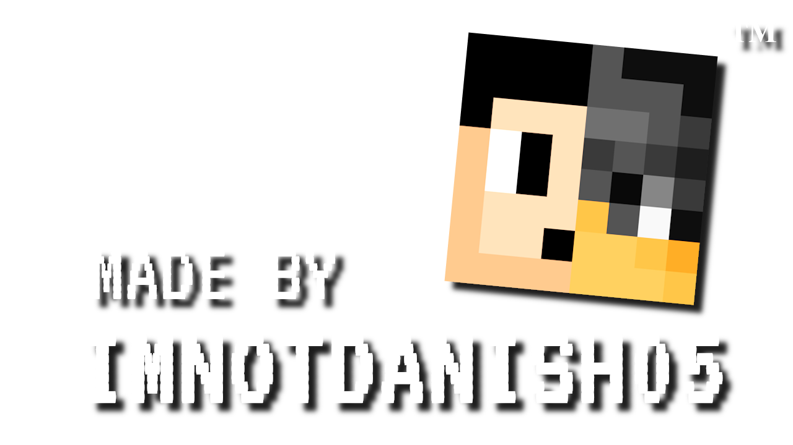

# PBL LIMS Backend Manager Sandbox

This repo is a minimal Laravel 11 + React/Inertia playground used to prototype and test LIMS backend manager. **The real production project lives here:** https://github.com/tiatiwaw/PBL_LIMS_TI-2A. Use this repo for quick model validation and UI experiments only.